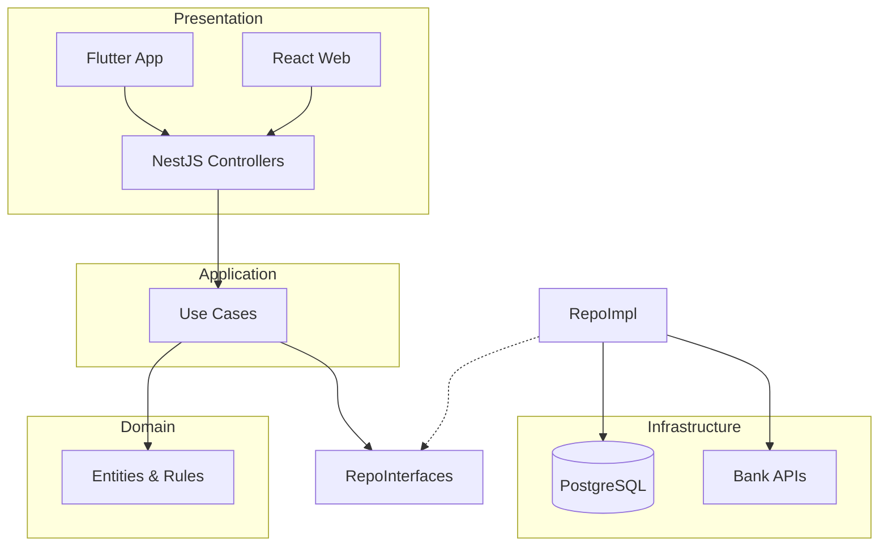
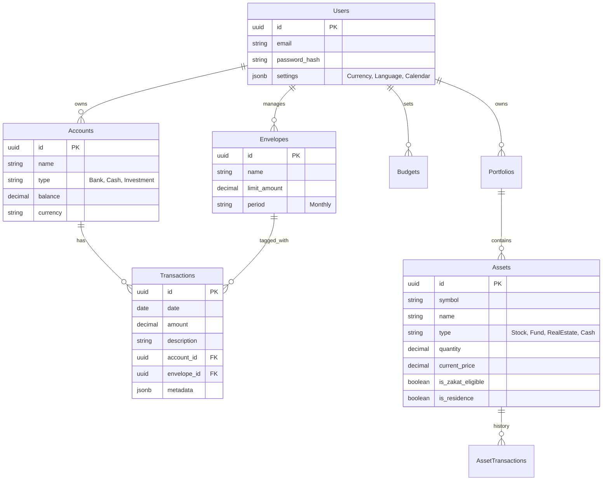

# Wafir - Technical Architecture

## 1. System Overview
Wafir follows a **Clean Architecture** approach to ensure separation of concerns, testability, and independence from frameworks.

### 1.1 Architectural Layers
1.  **Domain Layer (Core):** Entities, Value Objects, Domain Services, Repository Interfaces. *No external dependencies.*
2.  **Application Layer:** Use Cases (Interactors), DTOs. Orchestrates flow of data.
3.  **Infrastructure Layer:** Database implementation (TypeORM/Prisma), External APIs (Bank Feeds), Auth services.
4.  **Presentation Layer:**
    -   **API:** NestJS Controllers (REST/GraphQL).
    -   **Mobile:** Flutter (Riverpod + Clean Arch).
    -   **Web:** React (Redux Toolkit).

## 2. Database Design (ERD)

Wafir uses **PostgreSQL**.

## 3. Technology Stack
-   **Backend:** NestJS (Node.js), TypeScript.
-   **Database:** PostgreSQL 15+.
-   **Mobile:** Flutter (Dart).
-   **Frontend:** React (Vite).
-   **Cloud:** Azure (App Service, Postgres Flex, Key Vault).
-   **DevOps:** GitHub Actions, Terraform/Bicep.
